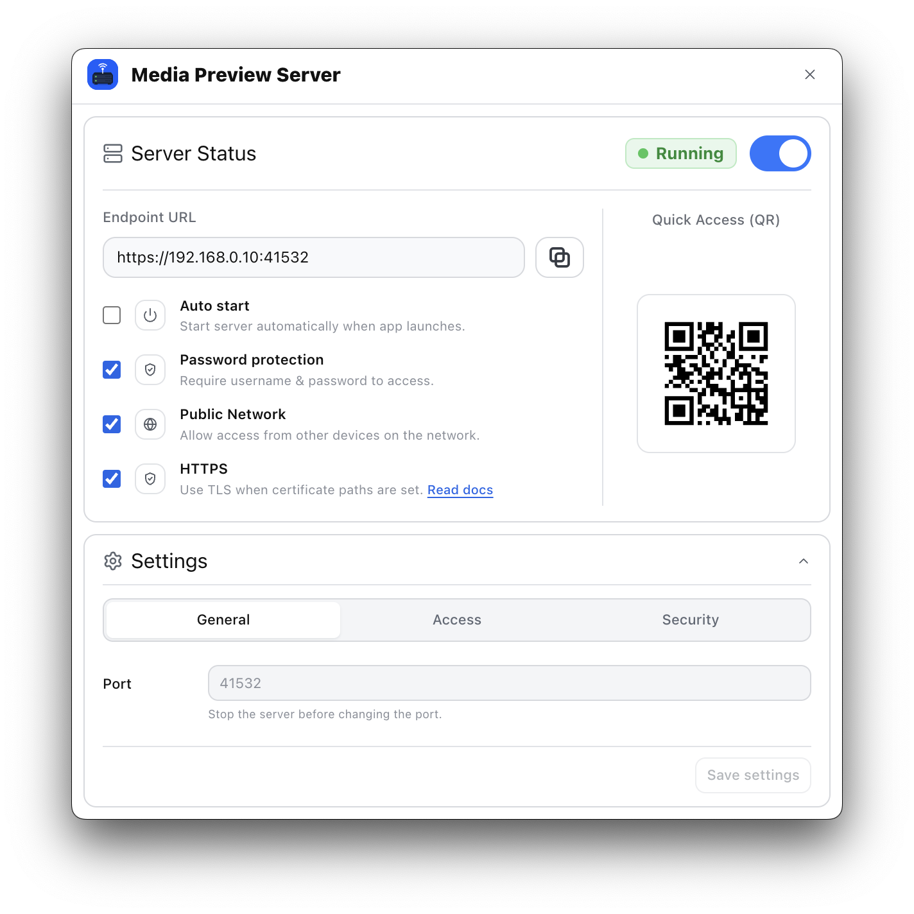

# Eagle | Media Preview Server Plugin

Media Preview Server is a tool that starts a local preview server for your Eagle library with one click.
You can preview your media from other devices on the same network.




## Features

- One-click local preview server for your Eagle library
- Browse Eagle media from phones, tablets, and other computers on the same LAN
- Endpoint URL and QR code for quick access

Optional:

- Auto start: start the server automatically when Eagle launches.
- Password protection: require a username and password to access the viewer.
- Public Network: allow access from other devices on the network.
- HTTPS: use TLS when certificate paths are set.
- Multiple users with Viewer, Editor, and Admin roles.

Roles:

- Viewer: browse and preview media
- Editor: edit rating, tags, and folders
- Admin: has all available permissions

## Requirements

- Eagle 4.0 Build 23 or later
- Node.js 20 or later

## Authentication

Authentication is optional. When password protection is enabled, browser access uses the built-in login screen and cookie-based sessions. Sessions expire after 7 days.

- Viewer users can browse and preview media.
- Editor users can edit rating, tags, and categories from the preview panel.
- Admin users have the highest available management permissions.

See [Eagle | Media Preview Server Spec](docs/EAGLE_PLUGIN_SPEC.md#authentication) for cookie, password storage, role, and session behavior details.

## Use HTTPS with mkcert

HTTPS protects the login password and session cookie on the network. For local/LAN use, `mkcert` is the recommended way to create a trusted development certificate.

- `TLS Cert`: the certificate file
- `TLS Key`: the matching private key file

See [HTTPS and mkcert CA Operations](docs/https-mkcert.md) for setup, plugin HTTPS settings, Windows/macOS/iOS/Android CA trust steps, and private-key cautions.

## Development

```sh
npm install
npm run dev
```

`npm run dev` starts the Vite development server for the React UI.

## Build

```sh
npm run build
```

Build output is written to `dist`.

## Verification

```sh
npm run typecheck
npm run build
npm test
```

Run `npm run verify` before committing when you need the full TypeScript, Vite build, and Vitest check in one command.

## Details

See [EAGLE_PLUGIN_SPEC.md](docs/EAGLE_PLUGIN_SPEC.md) for plugin behavior, settings, server routes, authentication, and runtime details.

## Disclaimer

This plugin is intended for use on a local or trusted LAN, not for public internet access.

The author is not responsible for unintended access, data exposure, or any damage caused by misconfiguration, insecure network settings, weak passwords, disabled authentication, or public exposure of the server.
